# 🔔 GALiveNotification

Android için **Live Update Notification** (Canlı Güncellenen Bildirimler) demo uygulaması. Sipariş takibi gibi çok aşamalı işlemlerde gerçek zamanlı bildirim güncellemeleri gösterir.

<div align="center">
  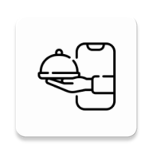
</div>

## 📱 Proje Hakkında

Bu proje, Android 15'te (API 36) tanıtılan **Live Update Notification** özelliğini kullanarak, kullanıcılara gerçek zamanlı güncellenen bildirimler göstermeyi amaçlar. Bir yemek sipariş uygulaması senaryosu üzerinden, siparişin hazırlanma aşamalarını canlı olarak takip edebilirsiniz.

### ✨ Öne Çıkan Özellikler

- 🔄 **İki Farklı Bildirim Modu**
  - **Foreground Service**: Arka planda güvenli ve kesintisiz bildirim güncellemeleri
  - **Direkt Bildirim**: Daha hızlı başlangıç, hafif kullanım için
  
- 📊 **Görsel İlerleme Gösterimi**
  - Dinamik ilerleme çubuğu
  - Renkli segmentler ve aşama göstergeleri
  - Her aşama için özel ikonlar

- ⚡ **Anında Başlatma**
  - Optimize edilmiş kod yapısı
  - İlk bildirimin gecikme olmadan gösterilmesi
  - Sorunsuz aşama geçişleri

- 🎨 **Jetpack Compose UI**
  - Modern Android UI toolkit
  - Material 3 tasarım dili
  - Karanlık tema desteği

## 🎯 Nasıl Çalışır?

### Bildirim Aşamaları

Uygulama, bir yemek siparişinin 5 farklı aşamasını simüle eder:

1. **Onaylanıyor** ⏳ (0 saniye - Anında)
   - İlk bildirim hemen gösterilir
   - İlerleme: Belirsiz (dönen animasyon)

2. **Hazırlanıyor** 🍳 (5 saniye sonra)
   - İlerleme: %25
   - Sarı segment ve mavi nokta gösterimi

3. **Yolda** 🚴 (10 saniye sonra)
   - İlerleme: %50
   - İki segment tamamlandı (yeşil renk)

4. **Kapıda** 🚪 (15 saniye sonra)
   - İlerleme: %75
   - Üç segment tamamlandı

5. **Tamamlandı** ✅ (20 saniye sonra)
   - İlerleme: %100
   - Tüm segmentler yeşil
   - "Teslimatı Değerlendir" aksiyon butonu eklenir
   - 3 saniye sonra bildirim/servis kapatılır

### Teknik Akış

#### Foreground Service Modu:
```
1. Butona Tıklama
2. İlk bildirim HEMEN gösterilir (NotificationManager.notify)
3. Foreground Service başlatılır
4. Service, kalan 4 aşamayı zamanlar (Handler.postDelayed)
5. Her aşamada bildirim güncellenir
6. Son aşamadan 3 saniye sonra servis otomatik durdurulur
```

#### Direkt Bildirim Modu:
```
1. Butona Tıklama
2. LiveNotificationManager.startNotificationWithoutService() çağrılır
3. İlk bildirim hemen gösterilir
4. Kalan aşamalar Handler ile zamanlanır
5. Her aşamada bildirim güncellenir
6. Son aşamadan 3 saniye sonra bildirim kaldırılır
```

## 🚀 Kurulum ve Çalıştırma

### Gereksinimler

- **Android Studio**: Ladybug | 2024.2.1 veya üzeri
- **Minimum SDK**: 36 (Android 15)
- **Target SDK**: 36
- **JDK**: 17
- **Kotlin**: 2.0+

### Adımlar

1. **Projeyi Klonlayın**
   ```bash
   git clone https://github.com/gkhnakbs/GALiveNotification.git
   cd GALiveNotification
   ```

2. **Android Studio'da Açın**
   - Android Studio'yu başlatın
   - "Open an Existing Project" seçin
   - Proje klasörünü seçin

3. **Çalıştırın**
   - Android 15 (API 36) cihaz veya emülatör gereklidir
   - Run butonuna basın (Shift + F10)

### İzinler

Uygulama otomatik olarak aşağıdaki izinleri ister:

- `POST_NOTIFICATIONS` - Bildirim gösterme izni
- `POST_PROMOTED_NOTIFICATIONS` - Live Update bildirimleri için
- `FOREGROUND_SERVICE` - Arka plan servisi çalıştırma
- `FOREGROUND_SERVICE_SPECIAL_USE` - Özel amaçlı foreground service

## 📂 Proje Yapısı

```
GALiveNotification/
│
├── app/src/main/
│   ├── java/com/gkhnakbs/galivenotification/
│   │   ├── MainActivity.kt                    # Ana aktivite, UI ve izin yönetimi
│   │   ├── LiveNotificationManager.kt         # Bildirim oluşturma ve yönetme
│   │   ├── LiveNotificationService.kt         # Foreground service implementasyonu
│   │   └── ui/theme/                          # Compose tema dosyaları
│   │
│   ├── res/
│   │   ├── drawable/                          # Bildirim ikonları
│   │   │   ├── live_notification_prepare.png
│   │   │   ├── live_notification_food_pan.png
│   │   │   ├── live_notification_courier.png
│   │   │   ├── live_notification_door.png
│   │   │   └── live_notification_check.png
│   │   ├── values/strings.xml                 # İngilizce metinler
│   │   └── values-tr/strings.xml              # Türkçe metinler
│   │
│   └── AndroidManifest.xml                    # İzinler ve servis tanımları
│
├── gradle/
│   └── libs.versions.toml                     # Bağımlılık versiyonları
│
├── build.gradle.kts                           # Proje yapılandırması
└── README.md                                  # Bu dosya
```

## 🔧 Kullanım

### LiveNotificationManager

Singleton bir nesne olarak tasarlanmıştır ve aşağıdaki fonksiyonları sağlar:

```kotlin
// Başlatma (Activity onCreate veya Service onCreate içinde)
LiveNotificationManager.initialize(context, notificationManager)

// İlk bildirimi al
val notification = LiveNotificationManager.getInitialNotification()

// Belirli bir durum için bildirim oluştur
val orderStates = LiveNotificationManager.getOrderStates()
val notification = LiveNotificationManager.buildNotificationForState(orderStates[2])

// Foreground service olmadan bildirim başlat
LiveNotificationManager.startNotificationWithoutService()

// Zamanlanmış bildirimleri iptal et
LiveNotificationManager.cancelScheduledTasks()

// Bildirimi kaldır
LiveNotificationManager.cancelNotification()

// Promoted notifications izni kontrolü
val isEnabled = LiveNotificationManager.isPostPromotionsEnabled()
```

### LiveNotificationService

Foreground service kullanarak bildirimleri yönetir:

```kotlin
// Servisi başlat
context.startForegroundService(Intent(context, LiveNotificationService::class.java))

// Servis otomatik olarak:
// - İlk bildirimi foreground notification olarak gösterir
// - Kalan aşamaları zamanlar
// - Tamamlandığında kendini durdurur
```

### Özelleştirme

Bildirim zamanlamalarını değiştirmek için `LiveNotificationManager.getOrderStates()` fonksiyonundaki `delay` değerlerini düzenleyin:

```kotlin
OrderStateData(
    delay = 5000,  // Milisaniye cinsinden gecikme
    progress = 25,
    iconResId = R.drawable.live_notification_food_pan,
    contentText = R.string.order_preparing_content,
    subText = R.string.order_status_preparing,
    ticker = R.string.order_preparing_ticker
)
```

## 🎨 Ekran Görüntüleri

### Ana Ekran

<p align="center">
  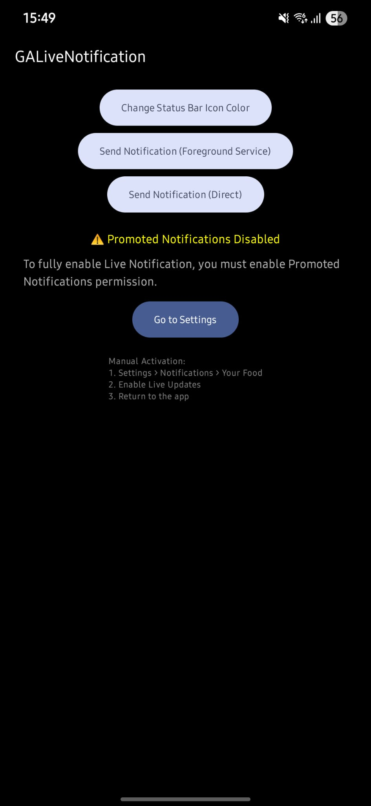
</p>

- Durum çubuğu renk değiştirme butonu
- Foreground service ile bildirim gönderme butonu
- Direkt bildirim gönderme butonu
- Promoted notifications izin durumu (varsa)

### Bildirim Çubuğu - Genişletilmiş Görünüm

<p align="center">
  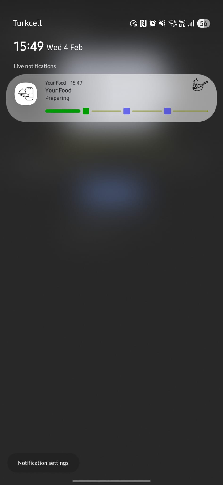
  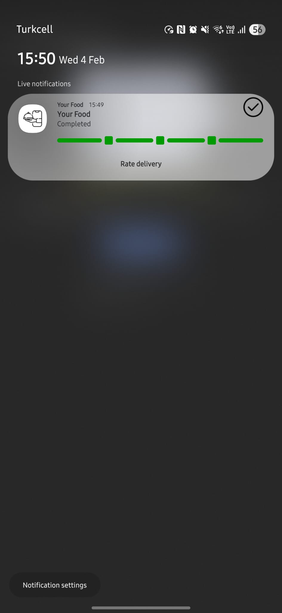
  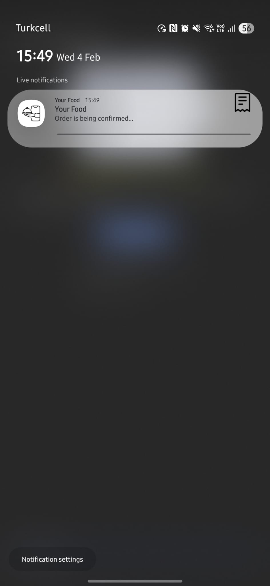
</p>

### Kilitle Ekranında Bildirim

<p align="center">
  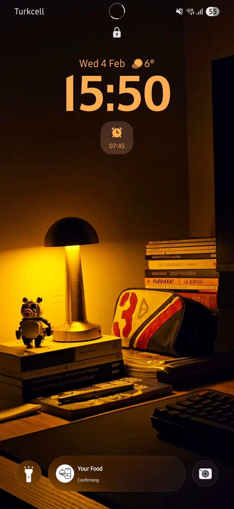
  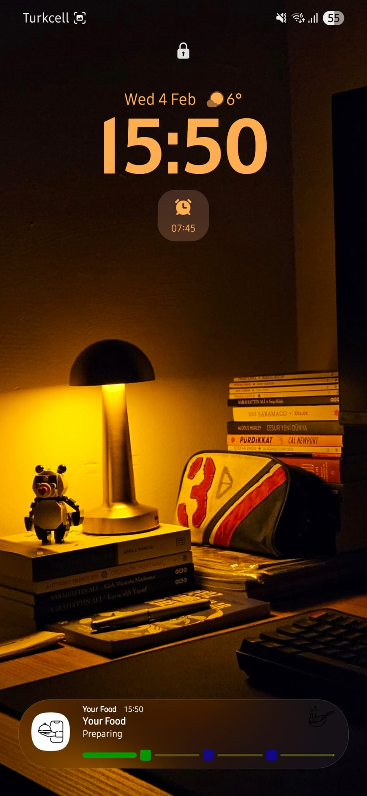
  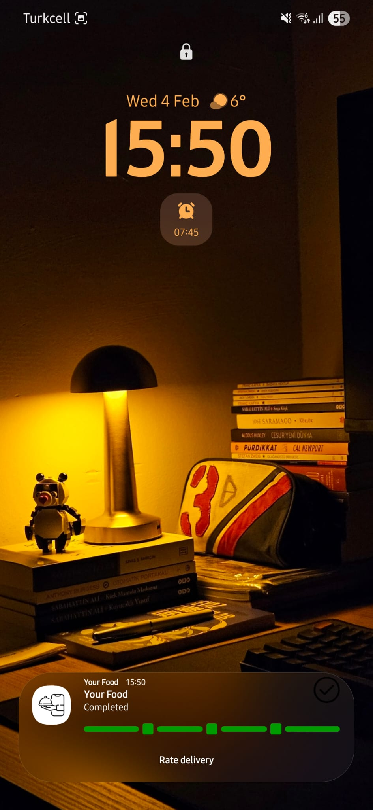
</p>

### Devam Eden Bildirimler

<p align="center">
  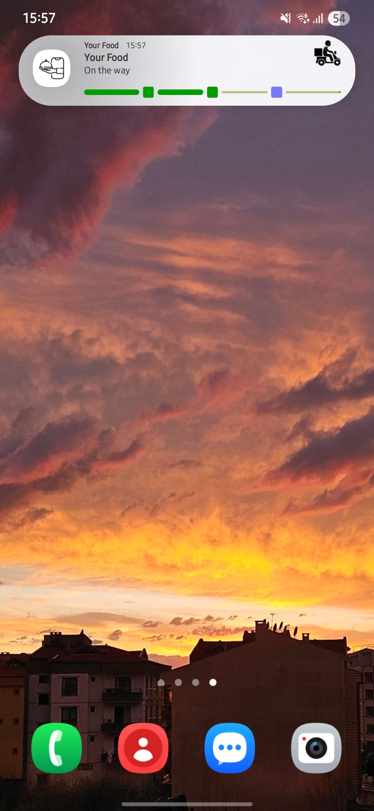
  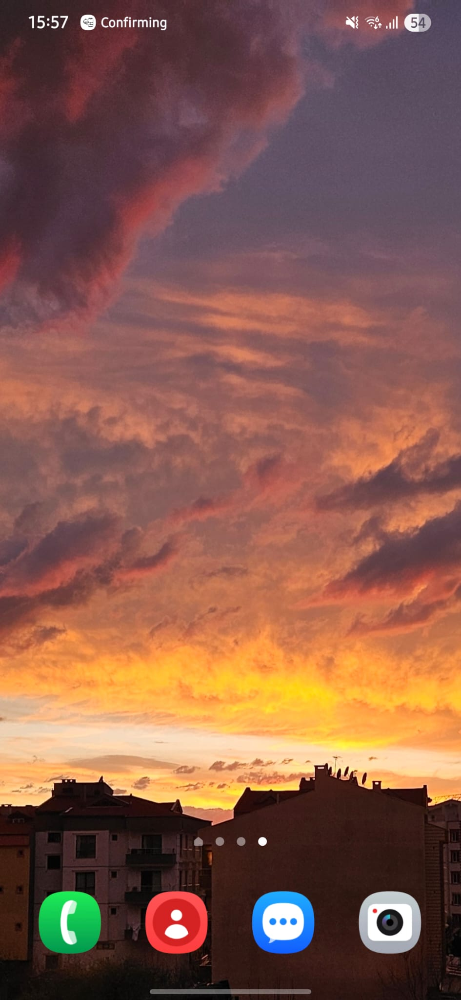
  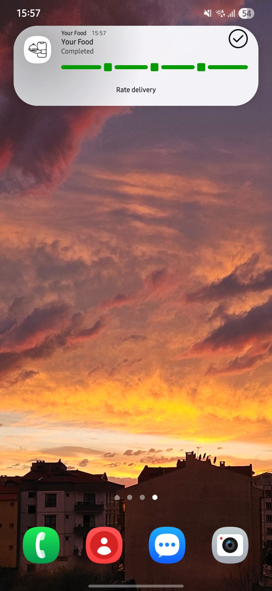
</p>

### Bildirim Özellikleri
- Uygulama ikonu ve adı
- Sipariş durum başlığı
- Durum açıklaması
- İlerleme çubuğu (segment ve nokta gösterileri)
- Büyük ikon (aşamaya özel)
- Aksiyon butonu (son aşamada)

## 🛠️ Teknolojiler

- **Kotlin** - Programlama dili
- **Jetpack Compose** - UI framework
- **Material 3** - Tasarım sistemi
- **Android Notification API** - Bildirim yönetimi
- **Foreground Service** - Arka plan işlemleri
- **Handler & Looper** - Zamanlama mekanizması

## 📊 Optimizasyonlar

### Performans İyileştirmeleri

1. **Lazy Initialization**: Handler ve NotificationManager nesneleri sadece gerektiğinde oluşturulur
2. **Gereksiz Tekrar Önleme**: İlk bildirim startForeground ile gösterildiği için tekrar gönderilmez
3. **Anında Gösterim**: MainActivity'de önce bildirim gösterilir, sonra servis başlatılır
4. **Bellek Yönetimi**: Runnable referansları tutulur ve iptal edilebilir

### Gecikme Sorununun Çözümü

**Önceki durum**: Foreground service başlayana kadar bildirim gösterilmiyordu (~500ms gecikme)

**Çözüm**: 
```kotlin
// MainActivity.onCheckout()
1. NotificationManager.notify() ile bildirim HEMEN gösterilir
2. startForegroundService() ile servis başlatılır
3. Servis aynı notification ID ile devam eder
```

Sonuç: **Sıfır gecikme** ile bildirim gösterimi

## 🌍 Çoklu Dil Desteği

- 🇬🇧 İngilizce (varsayılan)
- 🇹🇷 Türkçe

Yeni dil eklemek için `res/values-{language_code}/strings.xml` dosyası oluşturun.

## 📝 Lisans

Bu proje MIT lisansı altında lisanslanmıştır. Detaylar için [LICENSE](LICENSE) dosyasına bakın.

## 👤 Geliştirici

**Gökhan Akbaş**

## 🙏 Teşekkürler

Android Live Update Notification özelliğini keşfetmeme ilham veren Android geliştirici topluluğuna teşekkürler!

## 📚 Kaynaklar

- [Android Notification Guide](https://developer.android.com/develop/ui/views/notifications)
- [Foreground Services](https://developer.android.com/develop/background-work/services/foreground-services)
- [Jetpack Compose](https://developer.android.com/compose)

---

⭐ Projeyi beğendiyseniz yıldız vermeyi unutmayın!
- ✅ **Zaman Gösterimi**: Kronometreyle sayaç gösterimi
- ✅ **Otomatik Zamanlama**: Handler üzerinden otomatik adım ilerlemesi
- ✅ **Esneklik**: Farklı durum ve senaryolara özelleştirilebilir

## 📦 Gereksinimler

- **Android SDK**: API Level 36 (Android 15.0 / Baklava) ve üstü
- **Kotlin**: 1.9 ve üstü
- **Jetpack Compose**: Latest
- **AndroidX Core**: Latest

## 📄 Lisans

Bu proje MIT Lisansı altında lisanslanmıştır. Detaylı bilgi için [LICENSE](LICENSE) dosyasını inceleyiniz.

---

**Katkılar**: Bu proje için yapılacak katkılar memnuniyetle kabul edilir. Lütfen değişikliklerinizle bir pull request gönderin.
